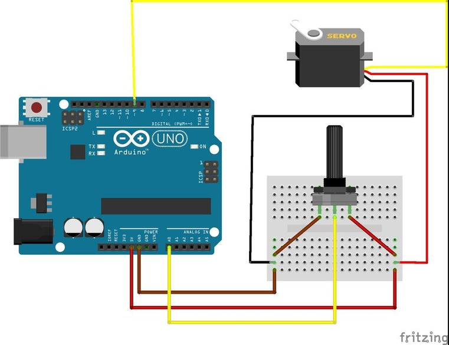
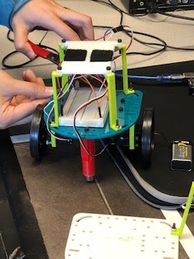

# Lab 1: Microcontrollers

## Overview
<!--- <p align="center"><iframe width="1000" height="1000" src="https://docs.google.com/document/d/e/2PACX-1vR3oHfjRKviqyxksJi9KCNizg3qEnQ053_olhdGpqgB8Zjcw23tClA871KAOig1w6ndVFHLDH6Kjf2j/pub?embedded=true"></iframe></p> --->

This lab focused on introducing the usage of a microcontroller, the Arduino Uno, and getting accustomed to using its IDE. To do this, we used the Arduino to blink LEDs on and off, adjust the LEDs brightness in an analog manner, and control servos that would be used in our initial rendering of our robot.

## Blinking LEDs

<iframe width="560" height="315" src="https://www.youtube.com/embed/9XaKIS4RhjM" frameborder="0" allow="accelerometer; autoplay; encrypted-media; gyroscope; picture-in-picture" allowfullscreen></iframe>

Our first task was to make the on-board LED blink using the “Blink” example code.  After getting it to work, we hooked up an external LED and modified the existing code provided.
One of the example pieces of code given to us in the Arduino IDE makes the internal LED on the Arduino chip blink on and off. Using this as a reference, we modified this code to apply to an external LED, which we connected in series with a resistor to one of the Arduino output pins. Each snippet of code consists mainly of a setup() and loop() method. The setup() function initializes any and is only run once at the beginning of the program. The loop() function continually runs and usually contains read/write pin operations. 

### External LED Code 

```c
#define LED 13
void setup() {
  // initialize digital pin LED_BUILTIN as an output.
  pinMode(LED, OUTPUT);
}

void loop() {
  digitalWrite(LED, HIGH);   // turn the LED on (HIGH is the voltage level)
  delay(1000);                   	// wait for a second
  digitalWrite(LED, LOW);	// turn the LED off by making the voltage LOW
  delay(1000);                   	// wait for a second
}
```

### Internal LED Code

```c
#define LED 13
int PIN = A1;

void setup()
 {
 // initialize digital pin LED_BUILTIN as an output.
     pinMode(LED, OUTPUT);
    Serial.begin(9600);
}

void loop() 
{
     int output;
     output = analogRead(PIN);
     Serial.println(output);
     delay(500);
}
```

## Adjusting LED Brightness

<iframe width="560" height="315" src="https://www.youtube.com/embed/VHoLj9fQv58" frameborder="0" allow="accelerometer; autoplay; encrypted-media; gyroscope; picture-in-picture" allowfullscreen></iframe>

The goal of this task was to use a rotating potentiometer to adjust the voltage fed into the LED and change its brightness. To do this, we set up a simple voltage divider by connecting the potentiometer (part number 3306F-103) in series with another resistor and connecting the voltage between the two components to the Arduino. At first, we accidentally used a resistor whose resistance value was much more than that of the potentiometer. After trying a few different ones, we settled on using a ~300 Ω resistor to put in series with the potentiometer.

We used an analog pin so we could use PWM (Pulse Width Modulation) to dim and brighten the LED and match this to the changing resistance of the potentiometer. The Arduino can only output digital signals. PWM varies the duty cycle (percentage of time in a cycle that a signal is high) to simulate an analog signal. 


### Potentiometer to LED Code

```c
#define LED 9
int PIN = A1;

void setup() 
{
     // initialize digital pin LED_BUILTIN as an output.
     pinMode(LED, OUTPUT);
     Serial.begin(9600);
}

void loop() 
{
     int output;
     int mapped_output;
     output = analogRead(PIN);
     Serial.println(output);
     mapped_output = map(output, 0, 1023, 0, 255);
     analogWrite(LED, mapped_output);
     delay(500);
}
```

## Servo Control

<iframe width="560" height="315" src="https://www.youtube.com/embed/eaiSxhrzdyk" frameborder="0" allow="accelerometer; autoplay; encrypted-media; gyroscope; picture-in-picture" allowfullscreen></iframe>

The next task was to control the rotation of small Parallax Continuous Rotation Servos that would be used to control the wheels on the first iteration of our robot. First we simply made it rotate, and then we used the potentiometer again in a similar manner, this time to control the speed of rotation of a servo. Writing inputs to the servo follows this rule: setting it to 90° makes it stop, 0° makes it rotate full speed in one direction, and 180° makes it rotate full speed in the opposite direction.




### Potentiometer to Servo Code

```c
#define LED 9
int PIN = A1;

void setup() 
{
     pinMode(LED, OUTPUT);
     Serial.begin(9600);
}

void loop() 
{
     int output;
     int mapped_output;
     output = analogRead(PIN);
     Serial.println(output);
     mapped_output = map(output, 0, 1023, 0, 255);
     analogWrite(LED, mapped_output);
     delay(500);
}

```

## Robot Assembly

At the end of Lab 1, we attempted to assemble our robot with the two servos and the provided 3D parts.  We had some trouble looking for tight-fit screws for the parts, but we eventually got the robot to move in a straight line.  Our next step would be to program the robot to drive in squares. 

The robot consists of a base plate with a platform mounted on top. The servo motors and wheels are connected to the base plate with brackets. The robot is stabilized with two ball bearings at the front and back of the plate. The battery for the robot is mounted underneath the base plate. The Arduino is located on the top platform and connects to a breadboard with additional wiring for the servos and sensors underneath. 




## Square Path of the Robot

<iframe width="560" height="315" src="https://www.youtube.com/embed/mawsl91q6_Q" frameborder="0" allow="accelerometer; autoplay; encrypted-media; gyroscope; picture-in-picture" allowfullscreen></iframe>

After assembling the robot, the last task of the lab was to have the robot move autonomously in a square pattern. We were able to leverage the code from the previous work we had done with servos. The robot alternates between going straight for several seconds and turning right for an even smaller number of seconds.  


### Robot Square Path Code

```c
int leftPin = A0; //left
int rightPin = A1; //right  //930 for white //1000 black

const int MotorLeft = 9; //left
const int MotorRight = 10; //right
#include <Servo.h>
Servo myservoleft; //left wheel
Servo myservoright; //right wheel


void setup() {
  // put your setup code here, to run once:
  Serial.begin(9600);

  myservoleft.attach(9);
  myservoright.attach(10);
}

void loop() {
  // put your main code here, to run repeatedly:
 
  //Straight
  myservoleft.write(100);
  myservoright.write(75);
  delay(3000);
  //Right turn
  myservoleft.write(100);
  myservoright.write(90);
  delay(1400);
}
```
