# Lab 2: Analog & Digital Circuitry and FFTs

The purpose of the lab is to create a working microphone circuit that will detect a whistle blow signifying the beginning of the race, which includes the amplifier circuit and the filter circuit.  We use the arduino FFT library to analyze the microphone signal.  

## FFT:
FFT (Fast Fourier transform) converts a signal from one domain to another. In this lab, the signals being converted are sound and light signals in the time domain and the output is translated into the frequency domain. As suggested by the Lab 2 write up, we leveraged the Open Music Labs FFT library. This library contained sample code that demonstrated how to extract frequencies from both sound and light. This helped us to distinguish the 950 Hz tone from other tones and from background noise.

We did research on the Microchip ATmega328P microcontroller located in the Arduino. The clock runs at 16 MHz and ADC conversion is 13 cycles long. By changing the value of the pre-scalar registers (in ADCSRA), one can change the resolution of the frequency measurements executed in the FFT program. With a 256 point FFT, the math works out as follows:

16 MHz / 32 prescalar / 13 clock cycles / 256 samples = 148.4Hz  ≈ 150 Hz

The 950 Hz tone was located between bins 6 and 7. This matches with the above calculations. You can see that the magnitude peaks at a value of 172.

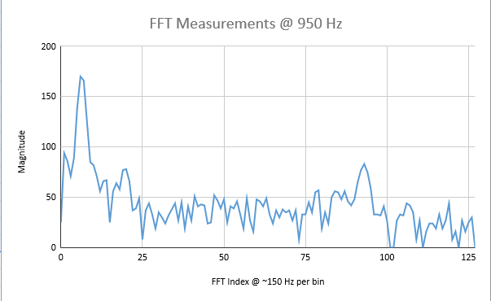

```c
/*
fft_adc_serial.pde
guest openmusiclabs.com 7.7.14
example sketch for testing the fft library.
it takes in data on ADC0 (Analog0) and processes them
with the fft. the data is sent out over the serial
port at 115.2kb.
*/

#define LOG_OUT 1 // use the log output function
#define FFT_N 256 // set to 256 point fft

#include <FFT.h> // include the library

void setup() {
  Serial.begin(9600); // use the serial port
  TIMSK0 = 0; // turn off timer0 for lower jitter
  ADCSRA = 0xe5; // set the adc to free running mode
  ADMUX = 0x40; // use adc0
  DIDR0 = 0x01; // turn off the digital input for adc0

  pinMode(2, OUTPUT);
}

void loop() {
  while(1) { // reduces jitter
	cli();  // UDRE interrupt slows this way down on arduino1.0
	for (int i = 0 ; i < 512 ; i += 2) { // save 256 samples
  	while(!(ADCSRA & 0x10)); // wait for adc to be ready
  	ADCSRA = 0xf5; // restart adc
  	byte m = ADCL; // fetch adc data
  	byte j = ADCH;
  	int k = (j << 8) | m; // form into an int
  	k -= 0x0200; // form into a signed int
  	k <<= 6; // form into a 16b signed int
  	fft_input[i] = k; // put real data into even bins
  	fft_input[i+1] = 0; // set odd bins to 0
	}
	fft_window(); // window the data for better frequency response
	fft_reorder(); // reorder the data before doing the fft
	fft_run(); // process the data in the fft
	fft_mag_log(); // take the output of the fft
	sei();
	Serial.println("############### start ############");
	for (byte i = 0 ; i < FFT_N/2 ; i++) {
  	Serial.println(fft_log_out[i]); // send out the data
	}

	if (fft_log_out[6] > 100 && fft_log_out[7] > 100)
	{
  	Serial.println("##### found target frequency ########");
  	Serial.println(fft_log_out[6]);
  	Serial.println(fft_log_out[7]);
  	digitalWrite(2, HIGH);  //turn on LED to indicate target frequency
  	delay(100);
	}
	else
	{
  	digitalWrite(2, LOW);  //turn off LED if not target frequency
  	delay(100);
	}
  }
}

```

To check for the signal, we check that the bins associated with the frequency 950 Hz have a magnitude of at least 100.

We performed several tests on varying frequencies to test that the FFT worked. One can see that the bins associated with the played frequency peak in magnitude.

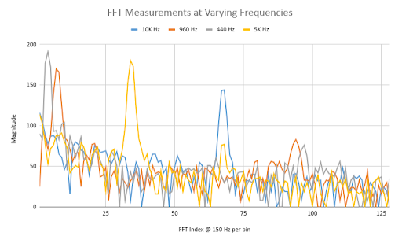

However, there were several issues with the raw data that is plotted above. The first is that the harmonics associated with that frequency tend  to have peaks as well, although the magnitude is not as large as the peak associated with the frequency’s bins. The second is that the first two bins always seem to have a rather large magnitude, usually around 80 or 90. Thus, filtering the signal would be helpful in detecting frequencies.


## Filter Circuit:

To focus on frequencies around 950 Hz., we built a simple second order active bandpass filter, the effects of which are shown in the following video demonstration.

<iframe width="560" height="315" src="https://www.youtube.com/embed/UrwO1bq51Mc" frameborder="0" allow="accelerometer; autoplay; encrypted-media; gyroscope; picture-in-picture" allowfullscreen></iframe>

In the video, an input from the function generator is fed into the filter at different frequencies, centering around 950 Hz. See the top two measurements on the right column of the oscilloscope screen. As the frequency decreases, the voltage amplitude also decreases as it gets further from 950 Hz. The same pattern can be seen when the frequencies are increased from 950 Hz. afterwards, demonstrating the roll-off in amplitude of the signal as the frequency strays from 950Hz.

Here is the circuit diagram (using the LM358 op amp):

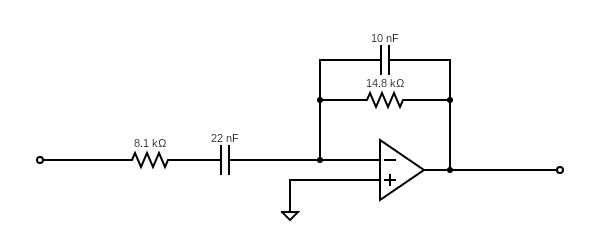

The circuit involves two sets of a resistor and a capacitor each, one in series and one in parallel. The bandpass filter defines two cutoff frequencies, at which the amplitude is supposed to be 3dB below the maximum output value. The series connection determines the lower cutoff frequency, by the equation:

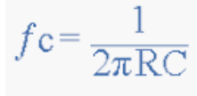

This gives the lower cutoff frequency as ~890 Hz. and similarly gives ~1080 Hz. as the higher cutoff frequency, centering near 950 Hz. as desired.


## Amplifier Circuit:

In order to amplify the microphone signal, we referenced the circuit from last year’s team Team Alpha.  

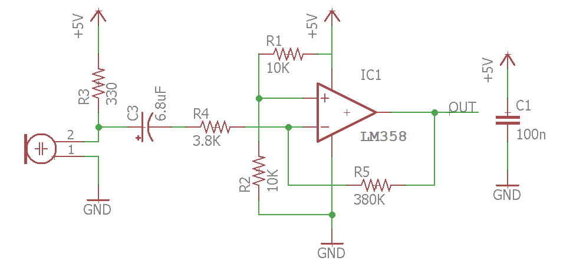

Here’s our physical circuit with microphone attached:

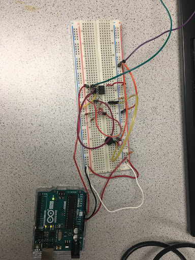

Initially, the microphone only outputs very small voltage ~200mV.  After adjusting the resistor values, we made the gain to be 100Av = -380K/3.8K = -100.  The figure on the left shows the amplifier output signal, which has a mean of 2.5V(it’s offsetted using the voltage divider).  The figure on the right shows the waveform when we played 440Hz into the microphone.

We then performed FFT using the output of the amplifier.  We attached an external LED to the circuit so it only turns on when certain bins[bin 7 and bin 8] are higher than 100.  As the frequency of the note played on the phone increases from 400Hz to around 1300 Hz, the LED responds to frequencies around 880Hz - 1100Hz without any filter attached.

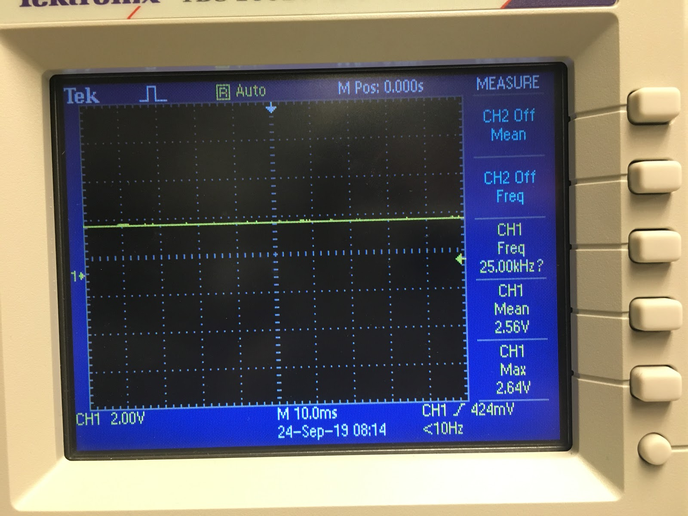 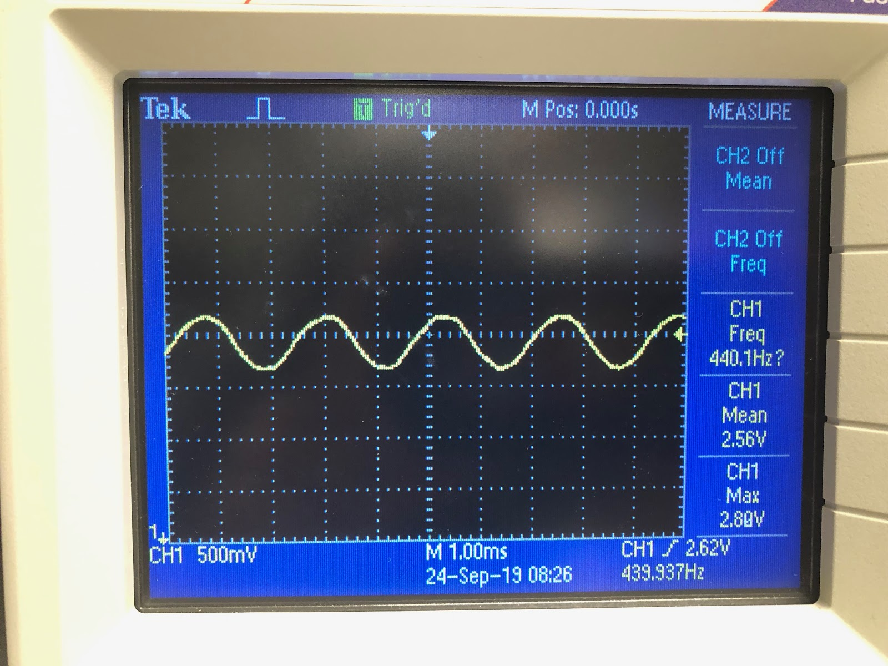

Below is a video of frequency sweep on the circuit:
<iframe width="560" height="315" src="https://www.youtube.com/embed/lrGkWGGs-EM" frameborder="0" allow="accelerometer; autoplay; encrypted-media; gyroscope; picture-in-picture" allowfullscreen></iframe>

## Additional Circuit

For the additional circuit, we built a voltage threshold sensor circuit for our wall sensors, referenced below:

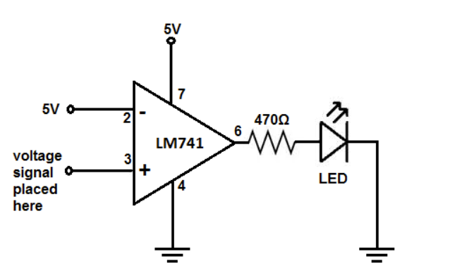

The 5V at the inverting input would be the reference voltage.  We decided to make the reference voltage 1V so that the output is high when the robot is within a certain distance to the wall which corresponds to a 1V output from the sensor.  We set up the circuit as below:


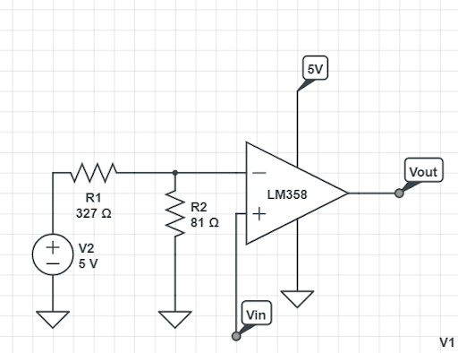

The voltage at the inverting terminal would be 5* (81/(81+327)) = 1V.  
Below is the picture of our physical circuit with wall sensor attached(wall sensor signal is connected to Vin):

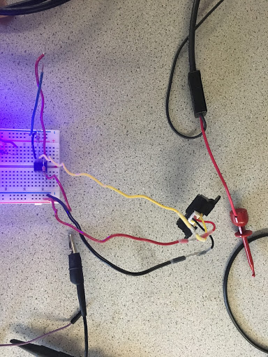

Testing using the Oscilloscope, the output is high when the wall sensor is within the threshold, and the output is low when the sensor is away.  The test code is attached below:

```c
int ledPin = 8;            	// LED connected to digital pin 13
int val = 0;

void setup()
{
  pinMode(ledPin, INPUT);  	// sets the digital pin as output
  Serial.begin(9600);
}

void loop()
{
  val = digitalRead(ledPin);   // sets the LED on
  delay(100);              	// waits for a second
  Serial.println("reading");
  Serial.println(val);
}
```

We interpret the output of the IR sensor as a digital voltage. Depending on if the sensor was placed close to or far from an obstacle, the value of the reading would be either 1 or 0.  
