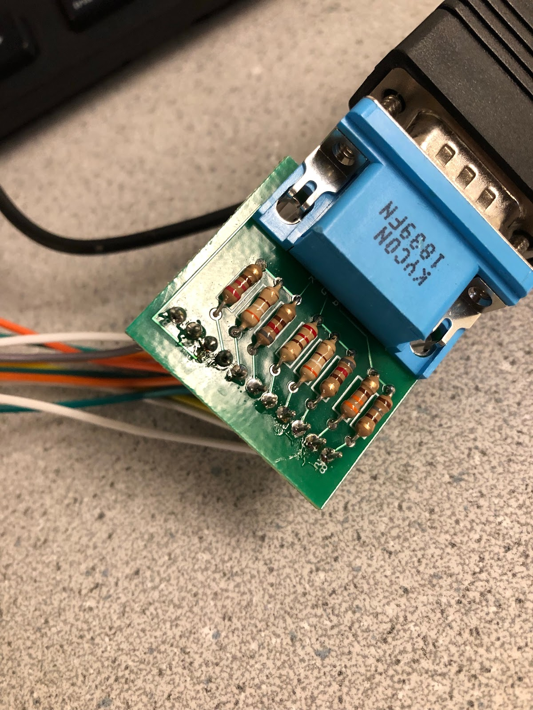
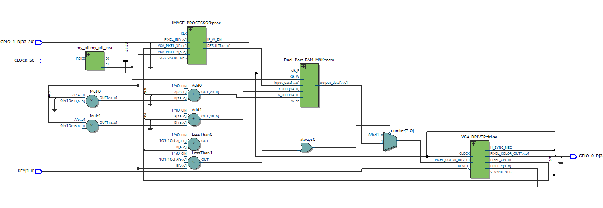
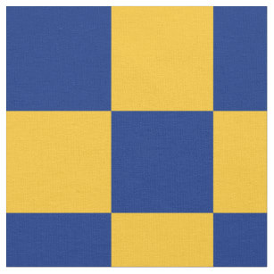
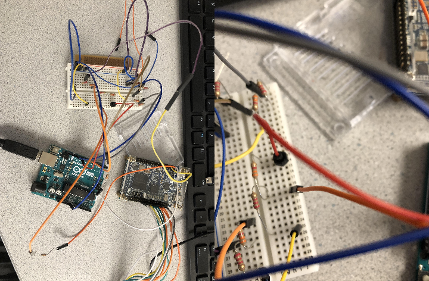

#Lab 3

The purpose of the lab is to create a video controller with an FPGA that displays information transmitted by an Arduino. We developed a basic system for transferring image information from the Arduino to the FPGA and learned how to interact with the video memory and VGA driver.

## VGA DAC Adapter

We originally used a leftover DAC from a past class. Due to unforeseen circumstances, we eventually ended up soldering our own. Following the tutorial instructions from the 2018 ECE 3400 website, we were able to create our own DAC, with ground, VSYNC, HSYNC, and RGB connections. Only the RGB connections needed resistors. We decided to encode our color values to correspond with the ones provided in the sample code.

The values are as following for the RGB resistor values:

| Color        | R   | R   | R   | G   | G   | G   | B   | B   |
|--------------|-----|-----|-----|-----|-----|-----|-----|-----|
| Resistor (Ω) | 220 | 390 | 820 | 220 | 390 | 820 | 330 | 180 |


It was very difficult to crimp the wires into the provided headers, so we soldered male to female wires to the perf board instead.



## Verilog Program  



This is the datapath of our modules. There are 3 modules currently our program:

PLL (Phase Lock Loop):
We use a phase lock loop to generate different clock lines that each of the modules needed to use. 25 MHz is required for the M9K RAM’s write cycles. The image processor matches this rate because we want the information from the image processor module to be written into the RAM. The VGA driver reads in data to output to the monitor at a rate of 24 MHz. Accordingly, the M9K RAM’s read rate must match this rate as well.

Image_processor.v:
This is the module in which the majority of our programming took place. The address (VGA_PIXEL_X, VIGA_PIXEL_Y) is the same as that of the VGA_driver.

We added a write enable (IP_W_EN) to the image processor. Without the write enable, we noticed that the monitor would display colors on pixels that we weren’t writing and at times appear extremely grainy or flicker. The write enable in the image processor is currently 256 (2^8)  times slower than the image processor’s clock  (at 25 MHz).  We tried several different powers of 2 and concluded that 2^8 was a good number. Too little (e.g. 2^4) meant the flicker would remain. Too much (e.g. 2^32) meant the address passed into the image processor was not being updated with the correct color because the address of the VGA_driver and the image_processor would be different for too long.


```Verilog
always @ (posedge CLK) begin
    /////////WRITE ENABLE LOGIC
   if (counter > 256) begin //counter > 2^8
   	  counter <= 8'b0 ;
    end
    else begin
   	counter <= counter + 1;
    end

    if(counter % 256 == 0)begin
   	 IP_W_EN <= 1'b0;
    end
    else begin
   	 IP_W_EN <= 1'b1;
    end     
end
```

The image_processor module is also responsible for mapping Arduino input coordinates to the corresponding square on the monitor / correct memory address. Our Arduino inputs is an 8-bit input called PIXEL_IN in which the first four inputs PIXEL_IN[7:4] are the x-coordinate, ranging from number 4’b0000 to 4’b1001 (decimal 0-9). The y-coordinate is similar, except it is PIXEL_IN[3:0].

The matrix is 9x9 so we made an 81 element array of 8 bits in which each bit is a color. The mapping is achieved by multiplying the coordinate by 30 because we declare the drawable portion of the monitor to be 270 x 270 (despite its larger size of 1024 x 768). This array saves the color of the tiles so that if the screen is redrawn, the tiles are correctly updated.  

This array stores the color of each tile in the monitor’s drawable portion. Each tile’s color is initialized to black as can be seen by the first for loop in the always block. Each tile can also be categorized with even and odd coordinates. In this example checkerboard, the top left square of the checkerboard has Arduino input coordinates (0,0). It’s diagonal is (1,1). One has both even coordinates and the other has both odd coordinates. Thus, they are labelled as the same color. Similarly, the yellow squares below and to the right of the top left square have Arduino coordinates (0,1) and (1,0). They both have an even and an odd coordinate and so they are colored the same color. This logic is used in our Arduino code, in which we colored squares with an even and an odd coordinate green and odd-odd or even-even square red. Full code can be found in appendix.



```Verilog

always @ (*) begin
    if (counter2 == 0) begin
   	 for (i = 0; i < 81; i = i + 1) begin
   		 tiles[i] <= 8'b000_000_00;
   	 end
    end
    if (counter2 > 256) begin
   	 counter2 <= 1;
    end
    else begin
   	 counter2 <= counter2 + 1;
    end
///    
    x_pos = PIXEL_IN[7:4];
    y_pos = PIXEL_IN[3:0];
    RESULT[33:8] <= 26'b0;

    if((VGA_PIXEL_X > x_pos*30 && VGA_PIXEL_X < (x_pos+1)*30) &&
      (VGA_PIXEL_Y > y_pos*30 && VGA_PIXEL_Y < (y_pos+1)*30)) begin

   	 if ((x_pos%2 == 0) && (y_pos%2 == 0)) begin    
   			 RESULT[7:0] <= 8'b111_000_00;
   			 tiles[y_pos + (x_pos*9)] <=  8'b111_000_00;
   		 end
   	 else if ((x_pos%2 == 1) && (y_pos%2 == 1)) begin    
   			 RESULT[7:0] <= 8'b111_000_00;
   			 tiles[y_pos + (x_pos*9)] <=  8'b111_000_00;
   		 end
   	 else if ((x_pos%2 == 1) && (y_pos%2 == 0)) begin    
   			 RESULT[7:0] <= 8'b000_111_00;
   			 tiles[y_pos + (x_pos*9)] <=  8'b000_111_00;
   		 end
   	 else if ((x_pos%2 == 0) && (y_pos%2 == 1)) begin    
   			 RESULT[7:0] <= 8'b000_111_00;
   			 tiles[y_pos + (x_pos*9)] <=  8'b000_111_00;
   		 end

      end
     else begin
     		 RESULT <= tiles[((VGA_PIXEL_Y/30) - ((VGA_PIXEL_Y%30)/30)) + (((VGA_PIXEL_X/30) - ((VGA_PIXEL_X%30)/30)) * 9)];


   	 end
end
```

Dual_port_M9K_ram.v:
This module was given to us by the sample code from the ECE 3400 2018 Lab 4 tutorial. This is the Verilog representation of memory on the FPGA and for this lab, serves as the VGA Frame buffer. We found Bruce Land’s tutorial on FPGA’s and Altera documentation as useful resources:
http://people.ece.cornell.edu/land/courses/ece3400/FPGA_Verilog/fpga_2018.html
https://www.intel.com/content/dam/www/programmable/us/en/pdfs/literature/hb/cyclone-iv/cyiv-51003.pdf
According to the documentation, Verilog can specify memories up in block sizes in units of M9K blocks. There were many operations that made using M9K RAM blocks useful (e.g. address clock enable, latch asynchronous clears). We did not alter this module.

Vga_driver.v:
This module was given to us by the sample code from the ECE 3400 2018 Lab 4 tutorial. The VGA driver generates the necessary VGA color and synchronization signals. It also outputs the x- and y-coordinates of the next pixel that is needed. It only has one input - which is the color that corresponds to the last pixel location given. This output information is encoded in the MEM_OUTPUT wire from the Dual_port_M9k_ram module to write to the monitor. We did not alter this module.

DE0_Nano.v:

This is the top-level module in which all three of the above modules are connected. This is also the module in which communication between the Arduino and the FPGA is handled.

We initialized pins 33 to 20 on the GPIO 1 port as inputs. Of these 13 pins, we eventually ended up using 1 - GPIO_1_D[25]. Based on if this pin is low or high, we either color tile 8'b1000_1000 ( ie 8,8) or 8'b0111_1000 ( ie 7,8).   

We also created two wires, FAKE_GPIO and RESULT. FAKE_GPIO simulates PIXEL_IN input of the image processor. For future labs and milestones, we will eventually add more GPIO pins so that it resembles the x-coordinate and y-coordinate encoding of our image_processor module. We currently have 1 GPIO pin but we plan to have at least 8 GPIO pins, each to represent one bit of the RGB representation. RESULT is the output of our image processor and is passed into the Dual Port Ram M9K module. The write address of the M9K module is updated by multiplying Y_ADDR (updated from VGA_PIXEL_Y in always block) by the screen width and adding that to X_ADDR (updated in always block from VGA_PIXEL_X as well). Full code can be found in appendix.

```Verilog

always @ (VGA_PIXEL_X, VGA_PIXEL_Y) begin
   	 READ_ADDRESS = (VGA_PIXEL_X + VGA_PIXEL_Y*`SCREEN_WIDTH);
   	 X_ADDR <= VGA_PIXEL_X;
   	 Y_ADDR <= VGA_PIXEL_Y;
  	/*Only write to the tile, otherwise don't enable*/
   	 if(VGA_PIXEL_X>(`SCREEN_WIDTH-1) || VGA_PIXEL_Y>(`SCREEN_HEIGHT-1))begin
   			 VGA_READ_MEM_EN = 1'b0;
   	 end
   	 else begin
   			 VGA_READ_MEM_EN = 1'b1;
   	 end
end


always @ (*) begin //GPIO_1_D[25]
    // FOR LAB 3
    if (GPIO_1_D[25] == 1'b0) begin
   	 FAKE_GPIO <= 8'b0000_0000;
   	 FAKE_GPIO <= 8'b1000_1000;
    end
    else begin
   	 FAKE_GPIO <= 8'b0000_0001;
   	 FAKE_GPIO <= 8'b0111_1000;
    end

end
```

## Hardware Arduino to FPGA connections

We voltage-divided output from the Arduino at 5V to input to the FPGA at 3.3V using a voltage-divider with resistances 3.3K and 2.2K ohms. We also connect a 330 ohm resistor to the input of the FPGA to protect the port. The left side of the FPGA board is port 1 (ie GPIO_1_D) and communicates with the Arduino via voltage on the breadboard. The right side of the board is port 0. (ie GPIO_0_D) and communicates with the monitor via the VGA DAC adapter.




The program currently flashed on the Arduino simply toggles the pin connected the FPGA on and off every 2 seconds. The program is provided in the code appendix.  

## Video
<iframe width="560" height="315" src="https://www.youtube.com/embed/Vl0RfMmRbgw" frameborder="0" allow="accelerometer; autoplay; encrypted-media; gyroscope; picture-in-picture" allowfullscreen></iframe>

# Code Appendix
We only included Verilog modules that we changed.

### Fpga_test.ino
```c
#define FPGA_25 10

int set_25 = 0;

void setup() {
  // initialize digital pin LED_BUILTIN as an output.
  Serial.begin(9600);
  pinMode(FPGA_25, OUTPUT);
  }

void loop() {
  if (set_25 == 0)
  {
	digitalWrite(FPGA_25, LOW);
	delay(5*1000);
	set_25 = 1;
  }
  else
  {
  //digitalWrite(FPGA_27, HIGH);   // turn the LED on (HIGH is the voltage level)
  delay(2*1000);
   Serial.println("low");
  digitalWrite(FPGA_25, LOW);
  delay(2*1000);
   Serial.println("high");
  digitalWrite(FPGA_25, HIGH);
  }
}
```

### DE0_Nano.v

```Verilog
// ORIGINAL VALUES
//`define SCREEN_WIDTH 176
//`define SCREEN_HEIGHT 144

// Values from VGA_DRIVER.v
`define SCREEN_WIDTH 270
`define SCREEN_HEIGHT 270

///////* DON'T CHANGE THIS PART *///////
module DE0_NANO(
    CLOCK_50,
    GPIO_0_D,
    GPIO_1_D,
    KEY
);

//=======================================================
//  PARAMETER declarations
//=======================================================
localparam RED = 8'b111_000_00;
localparam GREEN = 8'b000_111_00;
localparam BLUE = 8'b000_000_11;

//=======================================================
//  PORT declarations
//=======================================================

//////////// CLOCK - DON'T NEED TO CHANGE THIS //////////
input    	      			 CLOCK_50;

//////////// GPIO_0, GPIO_0 connect to GPIO Default //////////
output    	 	[33:0]   	 GPIO_0_D;
//////////// GPIO_0, GPIO_1 connect to GPIO Default //////////
input    	 	[33:20]   	 GPIO_1_D;
input    	  	[1:0]   	 KEY;

///// PIXEL DATA /////
reg [7:0]    pixel_data_RGB332 = 8'd0;

///// READ/WRITE ADDRESS /////
reg [14:0] X_ADDR;
reg [14:0] Y_ADDR;
wire [14:0] WRITE_ADDRESS;
reg [14:0] READ_ADDRESS;

assign WRITE_ADDRESS = X_ADDR + Y_ADDR*(`SCREEN_WIDTH);

///// VGA INPUTS/OUTPUTS /////
wire    		 VGA_RESET;
wire [7:0]    VGA_COLOR_IN;
wire [9:0]    VGA_PIXEL_X;
wire [9:0]    VGA_PIXEL_Y;
wire [7:0]    MEM_OUTPUT;
wire   		 VGA_VSYNC_NEG;
wire   		 VGA_HSYNC_NEG;
reg   		 VGA_READ_MEM_EN;

assign GPIO_0_D[5] = VGA_VSYNC_NEG;
assign VGA_RESET = ~KEY[0];

///// I/O for Img Proc /////
wire [33:0] RESULT;
reg [7:0]FAKE_GPIO;
//wire [7:0] test_wire;
//assign test_wire =  GPIO_1_D[25] ?  RED : 8'b111_111_11;


/* WRITE ENABLE */
wire W_EN; //reg W_EN;

///////* CREATE ANY LOCAL WIRES YOU NEED FOR YOUR PLL *///////
wire clock_24;
wire clock_25;
wire clock2_50;

assign GPIO_0_D[0] = clock_24;

// new code
reg right;

///////* INSTANTIATE YOUR PLL HERE *///////
my_pll    my_pll_inst (
    .inclk0 ( CLOCK_50 ), //50 Mhz
    .c0 ( clock_24 ),
    .c1 ( clock_25 ),
    .c2 ( clock2_50 )  
    );


///////* M9K Module *///////
Dual_Port_RAM_M9K mem(
    .input_data(RESULT[7:0]),//8'b100_010_11 //pixel_data_RGB332 //pixel_data should be 2 bits, save as much
    .w_addr(WRITE_ADDRESS),
    .r_addr(READ_ADDRESS),
    .w_en(W_EN),
    .clk_W(clock_25),
    .clk_R(clock_24), // write faster than read
    .output_data(MEM_OUTPUT)
);

///////* VGA Module *///////++

VGA_DRIVER driver (
    .RESET(VGA_RESET),
    .CLOCK(clock_24),
    .PIXEL_COLOR_IN(VGA_READ_MEM_EN ? MEM_OUTPUT :8'b100_010_11), //(VGA_READ_MEM_EN ? MEM_OUTPUT : (right ? RED : BLUE))
    .PIXEL_X(VGA_PIXEL_X),
    .PIXEL_Y(VGA_PIXEL_Y),
    .PIXEL_COLOR_OUT({GPIO_0_D[9],GPIO_0_D[11],GPIO_0_D[13],GPIO_0_D[15],GPIO_0_D[17],GPIO_0_D[19],GPIO_0_D[21],GPIO_0_D[23]}),
   .H_SYNC_NEG(GPIO_0_D[7]),
   .V_SYNC_NEG(VGA_VSYNC_NEG)
);

///////* Image Processor *///////
IMAGE_PROCESSOR proc(
    .PIXEL_IN(FAKE_GPIO[7:0]), //GPIO // GPIO_1_D[25]
    .CLK(clock_25),
    .VGA_PIXEL_X(VGA_PIXEL_X),
    .VGA_PIXEL_Y(VGA_PIXEL_Y),
    .VGA_VSYNC_NEG(VGA_VSYNC_NEG),
    .RESULT(RESULT),
    .IP_W_EN(W_EN)
);


///////* Update Read Address *///////
always @ (VGA_PIXEL_X, VGA_PIXEL_Y) begin
   	 READ_ADDRESS = (VGA_PIXEL_X + VGA_PIXEL_Y*`SCREEN_WIDTH);
   	 X_ADDR <= VGA_PIXEL_X;
   	 Y_ADDR <= VGA_PIXEL_Y;
  	/*Only write to the tile, otherwise don't enable*/
   	 if(VGA_PIXEL_X>(`SCREEN_WIDTH-1) || VGA_PIXEL_Y>(`SCREEN_HEIGHT-1))begin
   			 VGA_READ_MEM_EN = 1'b0;
   	 end
   	 else begin
   			 VGA_READ_MEM_EN = 1'b1;
   	 end
end


always @ (*) begin //GPIO_1_D[25]
    // FOR LAB 3
    if (GPIO_1_D[25] == 1'b0) begin
   	 FAKE_GPIO <= 8'b0000_0000;
   	 FAKE_GPIO <= 8'b1000_1000;
    end
    else begin
   	 FAKE_GPIO <= 8'b0000_0001;
   	 FAKE_GPIO <= 8'b0111_1000;
    end

end
Endmodule
```

### Image_processor.v

```Verilog
`define SCREEN_WIDTH 176
`define SCREEN_HEIGHT 144
`define NUM_BARS 3
`define BAR_HEIGHT 48

module IMAGE_PROCESSOR (
    PIXEL_IN,
    CLK,
    VGA_PIXEL_X,
    VGA_PIXEL_Y,
    VGA_VSYNC_NEG,
    RESULT,
    IP_W_EN
);


//=======================================================
//  PORT declarations
//=======================================================
input    [7:0]    PIXEL_IN;
input    	 CLK;

input [9:0] VGA_PIXEL_X;
input [9:0] VGA_PIXEL_Y;
input   		 VGA_VSYNC_NEG;

output reg [33:0] RESULT;
output reg IP_W_EN;

//assign RESULT = 33'b1;

reg [7:0] counter;
reg [7:0] tiles[80:0];
reg [7:0] counter2; // for initialization of tiles
integer i; //for for loop attempt in always block

reg [3:0] x_pos;
reg [3:0] y_pos;


always @ (posedge CLK) begin
    /////////WRITE ENABLE LOGIC
   if (counter > 256) begin //counter > 2^8
   	  counter <= 8'b0 ;
    end
    else begin
   	counter <= counter + 1;
    end

    if(counter % 256 == 0)begin
   	 IP_W_EN <= 1'b0;
    end
    else begin
   	 IP_W_EN <= 1'b1;
    end
    /////////////////////////////
    //RESULT[33:8] <= 26'b0;
    //RESULT[7:0] <= (PIXEL_IN[0])? 8'b111_000_00 : 8'b000_000_11;


end

always @ (*) begin

// attempt to initialize tiles to all 0 (black) [gets messed up if you remove this]
    if (counter2 == 0) begin
   	 for (i = 0; i < 81; i = i + 1) begin
   		 tiles[i] <= 8'b000_000_00;
   	 end
    end
    if (counter2 > 256) begin
   	 counter2 <= 1;
    end
    else begin
   	 counter2 <= counter2 + 1;
    end
///    
    x_pos = PIXEL_IN[7:4];
    y_pos = PIXEL_IN[3:0];
    RESULT[33:8] <= 26'b0;

    if((VGA_PIXEL_X > x_pos*30 && VGA_PIXEL_X < (x_pos+1)*30) &&
      (VGA_PIXEL_Y > y_pos*30 && VGA_PIXEL_Y < (y_pos+1)*30)) begin

   	 if ((x_pos%2 == 0) && (y_pos%2 == 0)) begin    
   			 RESULT[7:0] <= 8'b111_000_00;
   			 tiles[y_pos + (x_pos*9)] <=  8'b111_000_00;
   		 end
   	 else if ((x_pos%2 == 1) && (y_pos%2 == 1)) begin    
   			 RESULT[7:0] <= 8'b111_000_00;
   			 tiles[y_pos + (x_pos*9)] <=  8'b111_000_00;
   		 end
   	 else if ((x_pos%2 == 1) && (y_pos%2 == 0)) begin    
   			 RESULT[7:0] <= 8'b000_111_00;
   			 tiles[y_pos + (x_pos*9)] <=  8'b000_111_00;
   		 end
   	 else if ((x_pos%2 == 0) && (y_pos%2 == 1)) begin    
   			 RESULT[7:0] <= 8'b000_111_00;
   			 tiles[y_pos + (x_pos*9)] <=  8'b000_111_00;
   		 end

      end
     else begin

   		 // used to have x_pos and y_pos which were based on pixel_in rather than the next pixel to draw, which is why it was all the same color before
   		 RESULT <= tiles[((VGA_PIXEL_Y/30) - ((VGA_PIXEL_Y%30)/30)) + (((VGA_PIXEL_X/30) - ((VGA_PIXEL_X%30)/30)) * 9)];


   		 //(tiles[y_pos + (x_pos*9)] > 8'b000_000_00) ? 8'b000_000_11 : 8'b000_000_00 // for testing


   	 end


end


endmodule
```
