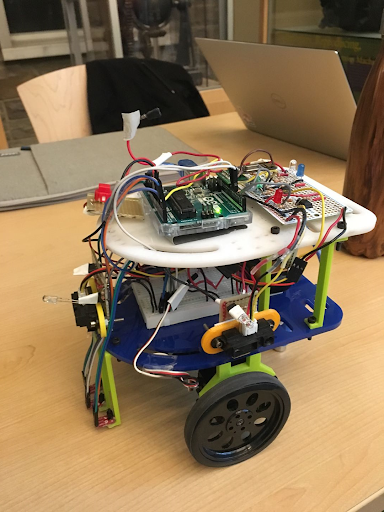
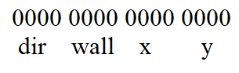
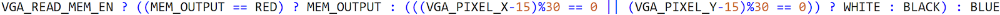
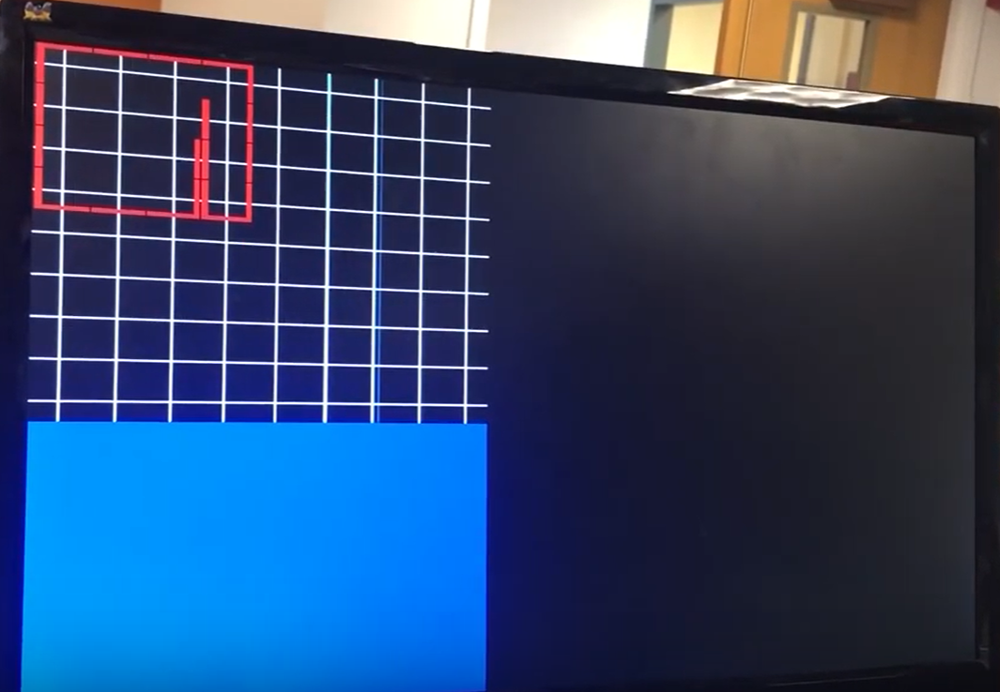
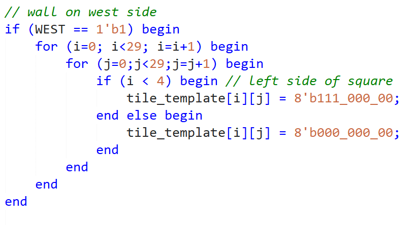
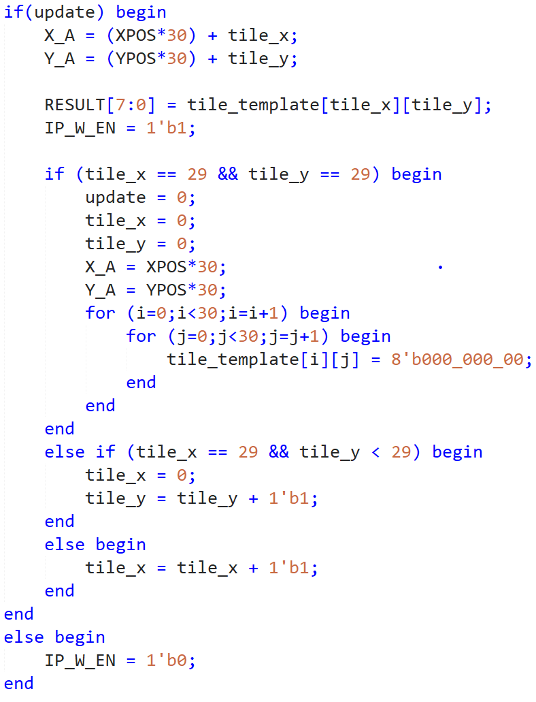

# Lab 4


## Robot



## Radio Protocol

We define one radio as the transmitter, and the other as the receiver. The transmitter is mounted on the robot, and the receiver is at the base station connected to the FPGA. Both radios are set-up in a similar fashion. We set the power level to the lowest possible. The more power is provided to the radio, the further it can transmit. However, the competition distance worked at the lowest possible power setting and it was not necessary for the radio to draw more power than it needed, so we set the power level to RF24_PA_MIN. We also set the payload size to 2 bytes because we were sending exactly 2 bytes between the radios.

```c
radio.setRetries(15,15);
  radio.setAutoAck(true);
    radio.setChannel(0x50);
    // RF24_PA_MIN=-18dBm, RF24_PA_LOW=-12dBm, RF24_PA_MED=-6dBM, and RF24_PA_HIGH=0dBm.
  radio.setPALevel(RF24_PA_MIN);
  //RF24_250KBPS for 250kbs, RF24_1MBPS for 1Mbps, or RF24_2MBPS for 2Mbps
  radio.setDataRate(RF24_250KBPS);
  radio.setPayloadSize(2);
  ```

The maze is 9 x 9 squares. In binary, 9 is 1001. Therefore, to encode maze information, the x-y coordinates of the maze require 8 bits total. This is convenient as 8 bits is a byte and a character. The wall information is 4 bits total. Each of these bits represents a wall expressed in terms of the cardinal directions. This was preferable to transmitting whether there were front, left, and right walls because the FPGA could more quickly display the walls rather than execute extra logic trying to decide how the walls should be displayed.

Thus, a total of twelve bits is sufficient to encode the information that is communicated between the 2 radios. However, since all processors and microcontrollers are byte-addressable, the result was that the size of information sent was two bytes (sixteen bits) instead. Thus, the maze information can be encoded as 1 byte for the location and 1 byte for the wall information. The navigation code of the robot provides all information such as wall obstacles, direction, and coordinates in our code. The transmitter’s data scheme leveraged bit shifting and bit masking to manipulate this information.  


```c
//radio transmit maze information
  radio.stopListening();
  wall = (ir_left_wall<<2)|(ir_front_wall << 1)|ri ;
  mz_msg = (dir << 12)| (wall << 8)|(x << 4)|y;  
  bool ok = radio.write( &mz_msg, sizeof(unsigned int) );
  radio.startListening();
  ```

It resembles this: 

For the x and y coordinates can be interpreted as a binary representation of the integer counterparts. The direction is also an integer. In the code, the directions are declared as constants.

  ```c
  //Global position
  int NORTH = 0;
  int EAST = 1;
  int SOUTH = 2;
  int WEST = 3;
  ```
The wall information is bit vectors in which each bit represents a wall.  

| n/a | Left | Right | Front |
|-----|------|-------|-------|
| 0   | 0    | 0     | 0     |

For example, if a robot is in coordinates (3,5)  in the south direction with a front wall and a left wall, this would be encoded as 0010 0110 0011 0101.  

This is an efficient data scheme because it does not use more information than is needed. This is also efficient because data can be sent as one integer - or sixteen bits as long as it is specified as unsigned. It is also capable of sending accurate maze information between Arduinos as all necessary information is provided. For example, providing coordinates can assist with mapping open spaces or unexplorable areas. Displaying walls on the FPGA is only possible by providing information to the base station about walls and direction.

The base station / receiver radio uses the information from the radio mounted on the robot to signal to the FPGA which walls to write. Pins are mapped to specific bits of the coordinate, for example:

```c
#define YCOORD_LSB 7
#define YCOORD_LSB2 6
#define YCOORD_LSB3 A0
#define YCOORD_MSB A1
```

These pins are set high or low depending on the corresponding decimal representation. These pins are written to from information we receive from masking and the data scheme of the transmitter radio. For example, we know that the x coordinate is contained in the fourth through eighth bits so we shift the integer containing the maze information to extract the information to mask with.     

```c
const uint8_t lsb_mask = 1;  // 0000_0001
const uint8_t lsb2_mask = 2;  // 0000_0010
const uint8_t lsb3_mask = 4;  // 0000_0100
const uint8_t msb_mask = 8;  // 0000_1000
void update_fpga_xcoord(void)
{
 //printf("xcoord: %d \n", (got_maze_info & xcoord_mask)>>4);
 digitalWrite(XCOORD_LSB,  (lsb_mask << 4) & got_maze_info);
 digitalWrite(XCOORD_LSB2, (lsb2_mask << 4) & got_maze_info);
 digitalWrite(XCOORD_LSB3, (lsb3_mask << 4) & got_maze_info);
 digitalWrite(XCOORD_MSB, (msb_mask << 4) & got_maze_info);
}
```

The above code shows how masking works in conjunction with the maze information to write the pins corresponding to the bits.

Direction and wall information is used to calculate the walls in accordance with the cardinal directions rather than with the direction of the robot and its immediate directions (i.e. front, left, right). For example, if the direction is north, and there is a front and right wall, this means that there is a wall to the north and to the east. This is convenient because the FPGA does not have to reorient the drawing based on the direction. Instead, the Arduino handles this. The DIR_OFST is necessary as the declarations of the pins in the base station are different than the constants in the transmitter code.
```c

#define NORTH 2
#define EAST 3
#define SOUTH 4
#define WEST 5
#define DIR_OFST 2

void update_fpga_wall(void)
{
 int dir = (got_maze_info & 12288) >> 12;
 int rt_dir = (dir + 1) % 4;
 int left_dir = (dir - 1 < 0)?3:((dir-1)%4);
 int behind = DIR_OFST + ((dir + 2) % 4);  //clear wall that's from behind
 int walls[10] {0};
 digitalWrite(behind, LOW);  
 walls[behind] = LOW;

 digitalWrite(left_dir + DIR_OFST,  left_mask & (got_maze_info>>8));
 walls[left_dir + DIR_OFST] = left_mask & (got_maze_info>>8);

 digitalWrite(rt_dir + DIR_OFST,  right_mask & (got_maze_info>>8));
 walls[rt_dir + DIR_OFST] = right_mask & (got_maze_info>>8);

 digitalWrite(dir + DIR_OFST,  front_mask & (got_maze_info>>8));
 walls[dir + DIR_OFST] = front_mask & (got_maze_info>>8);
}
```

## FPGA

We used the FPGA to create the display of our maze based on inputs sent wirelessly from the robot to our base station using the communication methods above. The inputs included the coordinates of the 9x9 maze, x and y each being four bits to include from 0 to 8, and another four bit input indicating which directions (which were absolute, set at the beginning of the maze run) there were walls in, each bit corresponding to north, south, east, and west respectively. One last input was sent from the base station Arduino whenever a packet of the above information was ready, and this was a single bit “update” input that told the FPGA when to update the display. All 13 bits of inputs were sent in parallel from the base station Arduino to the FPGA.

The hierarchy of modules is as follows: DE0-NANO is the top level module, which instantiates IMAGE_PROCESSOR, VGA_DRIVER, and M9K_RAM, and it also assigns clocks and inputs to different places in those modules. IMAGE_PROCESSOR is what determines how to draw the walls by coloring certain pixels at each location and when to write to the memory, where all pixel colors are stored. Once pixel colors are stored in the memory, the VGA_DRIVER reads the color at each memory address, which is unique to each pixel, and draws it on the screen. The reading address for the driver to read from the M9K RAM memory, which is defined as the the pixel row * screen width + pixel column, where (0, 0) is at the top left of the screen and the screen width and height are both 270 pixels. For example, the memory address for the column in the 100th row and 5th column is 100*270 + 5 = 27005. DE0-NANO sets a read enable wire high when the next pixel to draw is within the given screen size, and keeps it low otherwise.

Every node coordinate, (0, 0) to (8, 8), can be thought of as a 30x30 pixel square or array of pixels, which add up to the 270x270 pixel visible screen size. We set the VGA_DRIVER’s PIXEL_COLOR_IN input as follows for the purpose of drawing a grid on the display for the walls to be placed over:



This creates a white 9x9 grid with intersections in the middle of each 30x30 square as described above, representing the white lines that our robot follows in the maze. The walls are drawn in red between these lines, just as they lie in the maze, so that the maze is easily discernible by a viewer:



The IMAGE_PROCESSOR is what determines the color of every pixel (not including the white lines above, which  by writing to the M9K_RAM when there is an update. To do this, it uses the fact that each coordinate is the 30x30 square, and every time a new packet of inputs/information comes in from the robot, it creates a “tile_template” to draw to the maze. The template is a 2D 30x30 array of 8 bit numbers, representing an RGB color in the 8 bit format. Here is how the template is made:



In this section, a west wall is drawn on the 30x30 square by doing a double for-loop through the 2D array and setting all values where the i index, representing the x position, is less than a certain value so that the wall is drawn on the “left” side of the square, as the viewer sees it on the monitor. North, east, and south walls are put in the template in similar if-statements below this. The other ones do not include the else-statement which sets the rest of the pixels to black because if for example the north wall block below this did that, it would erase the west wall if one was drawn earlier.

After it creates this template, it sets the “update” wire high, which is the condition for another if-statement in the code. If “update” is high, it sets the memory x and y write addresses equal to the pixel coordinates at the top left of the 30x30 node we are drawing plus an offset determined by how many pixels we have already drawn of the template we created earlier. The offset is incremented every time a new pixel in that 30x30 square is drawn. It then sets the output RESULT equal to the color the pixel at the calculated address should have (from the template) and sets the write enable output high, so that the M9K_RAM will be written to.

The block after this is the incrementing block, where we make sure to go through all of tile_template and only draw within the 30x30 square we are supposed to. It does the incrementing by going across a single row by adding 1 to tile_x until it reaches 29, and then moving to the next row by adding 1 to tile_y and setting tile_x equal to 0. When it has then gone through all the rows and all the columns, it sets the update flag equal to zero and resets the template to all black so that the next coordinate template can be drawn. This code block is shown here:



All of this allows us to update the maze display at our base station in real time, showing a clear representation of the maze the robot traverses.

## Robot Algorithm

We refined our maze traversal algorithm from milestone 3 so the robot can update coordinates and visited nodes.  The algorithm uses a breadth first search and backtracks to an open route if all sides are blocked.  The robot keeps track of a global direction and its global position(x,y) at all times (NORTH, EAST, SOUTH, WEST).  We referenced Team Robots ‘N’ Roses’ website from 2018 and made some modifications.

### Structures and definitions
* We used a node struct to keep track of the node direction and its visited status.
```c
typedef struct {
byte node_direction;
bool visited;
}node;
```
* We declare a 9x9 matrix made of nodes, a prev_direction(direction the robot is coming from when entering the node), and a direction(the direction robot is facing).  We define our initial direction as SOUTH, and the first node the robot visits should be (0,1).  We define (0,0) as visited.  

### Helper functions
* We have two helper functions, get_x() and get_y(), in order to calculate the coordinate at each intersection based on the global direction.
```c
int get_x(int x, int globald){
  if (globald == WEST){
    return x-1;
    }
  else if (globald == EAST){
    return x+1;
    }
  else{
    return x;
    }
  }
int get_y(int y, int globald){
  if (globald == NORTH){
    return y-1;
    }
  else if (globald == SOUTH){
    return y+1;
    }
  else {
    return y;
    }
  }
  ```
* We wrote a mod() function to calculate the new direction if the robot has to turn around.
```c
int mod( int x, int y ){
   return x<0 ? ((x+1)%y)+y-1 : x%y;
}
```

### Robot decisions
* At each intersection, the robot first checks whether the current node has been visited.
```c
if (!maze[y][x].visited){
Serial.println("not visited");
maze[y][x].node_direction = prev_direction; //for backtracking
maze[y][x].visited = true;
visitablenode[y][x] = 0;
}
```
* We then calculate coordinates of the three possible directions that the robot can move to (front, right, and left) using the helper functions.
```c
//position of the nodes in the front
int front_x = get_x(x, prev_direction);
int front_y = get_y(y, prev_direction);
//position of the nodes on the right
int right_x = get_x(x, right);
int right_y = get_y(y, right);
//position of the nodes on the left
int left_x = get_x(x, left);
int left_y = get_y(y, left);
// position "behind"
int back_x = get_x(x, (prev_direction+2)%4);
int back_y = get_y(y, (prev_direction+2)%4);
```
* We then determine the situation around the robot using ternary operators as below:
```c
bool right_block = ri ? 1 : maze[right_y][right_x].visited;
bool left_block = ir_left_wall ? 1 : maze[left_y][left_x].visited;
bool front_block = ir_front_wall ? 1 : maze[front_y][front_x].visited;
```
* We use a series of if statements to figure out where the robot should go based on the surrounding situation:
```c
if (detected == 1){
Serial.println("*********Robot Detected***********");
dir = mod(dir + 2, 4);
turnAround();
x = back_x;
y = back_y;
detected = 0;
digitalWrite(robotLED, LOW);
}
else if (!ir_front_wall && ir_left_wall && ri && (maze[back_y][back_x].visited==true)) {
  Serial.println("Return from dead end");
  moveStraight();
  x = front_x;
  y = front_y;
}
else if (right_block && left_block && front_block){ // right_block && left_block && front_block
    curr_node = maze[y][x];
    dir = mod(curr_node.node_direction + 2, 4);
    Serial.println(dir);
    if (dir == left) {
      turnLeft();
      x = left_x;
      y = left_y;
      Serial.println("dir is left");
    }
  else if (dir == right) {
    turnRight();
    x = right_x;
    y = right_y;
    Serial.println("dir is right");
  }
  else if (dir == prev_direction) {
    moveStraight();
    x = front_x;
    y = front_y;
  }
  else {
    turnAround();
    x = back_x;
    y = back_y;
  }
  //deadend();
}
else if (front_block && !right_block){
  x = right_x;
  y = right_y;
  //turn right

  }
else if (front_block && !left_block){
  x = left_x;
  y = left_y;
  //turn left
}
else {
  x = front_x;
  y = front_y;
  //move straight
}
```

### Robot Detection
* At each intersection, we first check if the phototransistor value is above the threshold.  If so, the integer DETECTED goes high.  In DFS, if this bit is high, the robot will turn around and backtracks to the last node it visited.  Unfortunately, we didn’t have time to take a video of robot detection.  
```c
if (detected == 1){
Serial.println("*********Robot Detected***********");
dir = mod(dir + 2, 4);
turnAround();
x = back_x;
y = back_y;
detected = 0;
digitalWrite(robotLED, LOW);
}
```

### Finished Signal
* Inside the 9x9 visit able node matrix, we keep track of which nodes are open at each intersection.  We set the coordinate bit to 0 if it could be visited, and we set it back to 1 when the robot visits that coordinate.  For instance:
```c
if(!right_block){
  visitablenode[right_y][right_x] = 1;
  }
if(!left_block){
  visitablenode[left_y][left_x] = 1;
  }
if(!front_block){
  visitablenode[front_y][front_x] = 1;
  }
```
* At every intersection, we check if every node in the matrix has been visited (if all are true).  If so, we turn on the finished LED(white, because the lab ran out of green LEDS).
```c
flag = false;
visitablecounter = 0;
for(i = 0; i < 9 ; i++) {
  for(j = 0; j < 9; j++){
    if (visitablenode[i][j] > 0) {
      flag = true ;
      visitablecounter++;
      }
    }
  }
```

### Override button
* We implement the override button so the robot only runs code when the button is pressed.
```c
if(push == HIGH)
{
  buttoncount=1;
}
if(buttoncount==1)
{

  robotmove(leftsensor,rightsensor, middlesensor, maze, detected);
}
else
{
  stop();
}
```

### Robot LEDs
* We have a total of 5 LEDs on the robot:
  * Red for left wall sensor
  * Green for front wall sensor
  * Yellow for right wall sensor
  * Blue for robot detected
  * White for maze finished.

The following shows the robot successfully traversing through the maze and goes back to the starting position with override button, DFS, and finishing LED(White LED) implemented:

* Video of maze traversal:
<iframe width="560" height="315" src="https://www.youtube.com/embed/g1RghFpJ86U" frameborder="0" allow="accelerometer; autoplay; encrypted-media; gyroscope; picture-in-picture" allowfullscreen></iframe>

* Video of base station updating:
<iframe width="560" height="315" src="https://www.youtube.com/embed/4Zp_xTr-vvc" frameborder="0" allow="accelerometer; autoplay; encrypted-media; gyroscope; picture-in-picture" allowfullscreen></iframe>  
