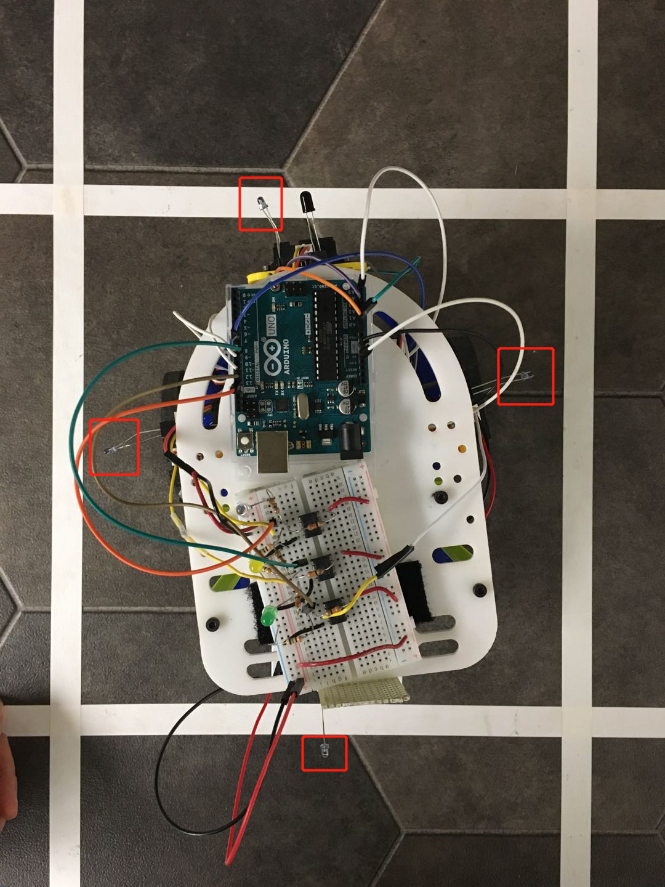
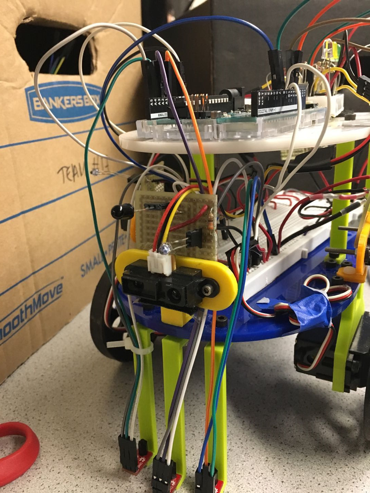

# Milestone 3:


## Phototransistor

To implement robot detection, we used a 880nm phototransistor and 4 880nm IR emitters.  The four IR emitters are mounted on four sides of the robot(as shown in the picture below).  The phototransistor is mounted on the protoboard in the front of the robot at 5 inches above the ground.  






We first tested the threshold of the phototransistor and decided that the threshold was 200.  As the IR emitter gets farther from the phototransistor, the value decreases.  Our testing code is below:

```c
int photoTran = A5;
int reading = 0;
int ir_led = 8;

void setup(){
  pinMode(photoTran,INPUT);
  pinMode(ir_led, OUTPUT);
  digitalWrite(ir_led, HIGH);   // turn the LED on (HIGH is the voltage level)
  Serial.begin(9600);
}

void loop(){
  reading = analogRead(photoTran);
  Serial.println(reading); //should detect high reading
}
```

When a robot is detected, it turns around and keeps going.  We also added an LED to indicate when a robot is detected.  The robot detection code block is shown below:

```c
void robotdetect(int photo)
{
  if(photo > 200)
  {
   Serial.println("DETECTED");
   digitalWrite(robotLED, HIGH);
   turnaround();
  }
  else{
     digitalWrite(robotLED, LOW);
    }
}
```

Here’s our video showing robot detection.  The robot is able to turn around at least 1 foot away(it was closer the second time because we didn’t hold it at the same level).

<iframe width="560" height="315" src="https://www.youtube.com/embed/9tzh-STX8Gs" frameborder="0" allow="accelerometer; autoplay; encrypted-media; gyroscope; picture-in-picture" allowfullscreen></iframe>


## Maze traversal

Our robot uses DFS to traverse a 4x5 maze. Our program uses a struct that we implemented and a stack to keep track of the previous visited intersections. In our implementation for DFS we designated the intersections as nodes. Our struct is the node which has a couple of data values. The node keeps track of the available directions the robot can move: front left and right. Depending on the wall configurations and open routes the Arduino creates a node based on these inputs and assigns an int to the direction. A 0 in the struct indicates that the robot has already went down the path. A 1 indicates the robot has yet to move down that path. A 2 indicates that there is a wall in that direction and the robot should not turn in that direction. All of the nodes(intersections) are kept in a stack. The stack adds node based on recency and once the robot goes in all possible directions from that node it deletes the node. After visiting all locations of a node the robot returns back to previous node on the stack. For the robot to know it should move to the previous node, we have a bool called comeback. Comeback become true if the robot reaches a deadend. Since it hits a deadend the only place it will go is back to the node it came from. Deadends are an essential part for this DFS algorithm as every path either has a deadend or new node. Our DFS method is only called once the robot hits an intersection or a cross between the tape. Otherwise it continues forward or turns based on its line following method from the previous milestones.  

struct
```c
bool comeback = false;
typedef struct{
  int visited;
  int right;
  int left;
  int front;

} Node;//0gone,1available,2wallnogo

Node ok[100];
int count=0;

```

DFS method

```c
void dfs()
{
  //Serial.println("dfs");
  //if(leftsensor < lefthreshold && rightsensor < rithreshold)
  //{

    Serial.println("intersection");
    delay(100);
    ir_front_wall = digitalRead(ir_front);
    ir_right_wall = digitalRead(ir_right);
    ir_left_wall = digitalRead(ir_left);

    Serial.println(checkfront());
    Serial.println(checkleft());
    Serial.println(checkright());
    int left=checkleft();
    int right=checkright();
    int front=checkfront();
    //intersections
    //delay(500);
    if(ir_right_wall == HIGH && ir_left_wall==HIGH && front==HIGH)
    {
      //matrix[row][col]=0;
      Serial.println("deadend");
      turnaround();
      comeback=true;
      count--;
      Serial.println(comeback);
      Serial.println(count);

    }
    else if(front==LOW && ir_right_wall == LOW && ir_left_wall==LOW)
    {
      turnRight();
      //coming back from node
      if(comeback)
      {
        //front
        if(ok[count].front==1)      {
          turnRight();
        ok[count].front=0;
         count++;
          comeback=false;
        }
        //left
        {
          turnRight();
          ok[count].left=0;
          count++;
          comeback=false;
        }
      //first time new node
      else
      {
      Node a;
      a.right=0;
      a.front=1;
      ok[count]=a;
      count++;
      turnRight();
     Serial.println("node");
      }

    }
    else if(front==HIGH && ir_right_wall == LOW && ir_left_wall==LOW)
    {
      if(comeback)
      {
        if(ok[count].front==1&&ok[count].right==2)
        {
          Serial.println("new");
          turnLeft();
          count++;
          comeback=false;
          ok[count].front=0;
        }
        else if(ok[count].front==1&&ok[count].left==2)
        {
          turnRight();
          count++;
          comeback=false;
          ok[count].front=0;
        }
      }
      //first time
      else
      {
      Node a;
      a.right=0;
      a.left=1;
      a.front=2;
      ok[count]=a;
      count++;
      turnRight();
      Serial.println("fronthighnode");
      }

    }
    else if(front==LOW && ir_right_wall == LOW && ir_left_wall==HIGH)
    {
      Node a;
      a.right=0;
      a.left=2;
      a.front=1;
      ok[count]=a;
      count++;
      turnRight();
      Serial.println("node");
    }
    else if(front==LOW && ir_right_wall== HIGH && ir_left_wall==LOW)
    {
      Serial.println("First");
      if(comeback)
      {
        Serial.println("T");
        //Serial.println(ok[count].left);
        if(ok[count].left==1)
        {
          Serial.println("move ahead");

          ok[count].left=0;
          count++;
          moveStraight();
          delay(250);
          Serial.println("delay done");
          comeback=false;
          //moveStraight();
        }
      }
      //first time
      else
      {
      Node a;
      a.right=2;
      a.left=1;
      a.front=0;
      ok[count]=a;
      count++;
      turnLeft();
      Serial.println("node");
      }

    }
    else if(front && ir_right_wall){
    Serial.println("fr and ri");
    turnLeft();
  }
  else if(front && ir_left_wall){
    Serial.println("fr and le");
    turnRight();
  }
  else
  {
    moveStraight();
  }
}
``


### Video

<iframe width="560" height="315" src="https://www.youtube.com/embed/TgkGh3MQWD8" frameborder="0" allow="accelerometer; autoplay; encrypted-media; gyroscope; picture-in-picture" allowfullscreen></iframe>
