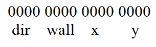

# Milestone 3:

The following shows the robot successfully traversing through the maze and goes back to the starting position with override button, DFS, and finishing LED(White LED) implemented:

* Video of maze traversal:
<iframe width="560" height="315" src="https://www.youtube.com/embed/g1RghFpJ86U" frameborder="0" allow="accelerometer; autoplay; encrypted-media; gyroscope; picture-in-picture" allowfullscreen></iframe>

* Video of base station updating:
<iframe width="560" height="315" src="https://www.youtube.com/embed/4Zp_xTr-vvc" frameborder="0" allow="accelerometer; autoplay; encrypted-media; gyroscope; picture-in-picture" allowfullscreen></iframe>  


## Robot LEDs
* We have a total of 5 LEDs on the robot:
  * Red for left wall sensor
  * Green for front wall sensor
  * Yellow for right wall sensor
  * Blue for robot detected
  * White for maze finished.

## Robot Detection

At each intersection, we first check if the phototransistor value is above the threshold.  If so, the integer DETECTED goes high.  In DFS, if this bit is high, the robot will turn around and backtracks to the last node it visited.  Unfortunately, we didn’t have time to take a video of robot detection.  
```c
if (detected == 1){
Serial.println("*********Robot Detected***********");
dir = mod(dir + 2, 4);
turnAround();
x = back_x;
y = back_y;
detected = 0;
digitalWrite(robotLED, LOW);
}
```

## Robot Communication with Base Station

We define one radio as the transmitter, and the other as the receiver. The transmitter is mounted on the robot, and the receiver is at the base station connected to the FPGA. Both radios are set-up in a similar fashion. We set the power level to the lowest possible. The more power is provided to the radio, the further it can transmit. However, the competition distance worked at the lowest possible power setting and it was not necessary for the radio to draw more power than it needed, so we set the power level to RF24_PA_MIN. We also set the payload size to 2 bytes because we were sending exactly 2 bytes between the radios.

```c
radio.setRetries(15,15);
radio.setAutoAck(true);
radio.setChannel(0x50);
// RF24_PA_MIN=-18dBm, RF24_PA_LOW=-12dBm, RF24_PA_MED=-6dBM, and RF24_PA_HIGH=0dBm.
radio.setPALevel(RF24_PA_MIN);
//RF24_250KBPS for 250kbs, RF24_1MBPS for 1Mbps, or RF24_2MBPS for 2Mbps
radio.setDataRate(RF24_250KBPS);
radio.setPayloadSize(2);
```  

The maze is 9 x 9 squares. In binary, 9 is 1001. Therefore, to encode maze information, the x-y coordinates of the maze require 8 bits total. This is convenient as 8 bits is a byte and a character. The wall information is 4 bits total. Each of these bits represents a wall expressed in terms of the cardinal directions. This was preferable to transmitting whether there were front, left, and right walls because the FPGA could more quickly display the walls rather than execute extra logic trying to decide how the walls should be displayed.

Thus, a total of twelve bits is sufficient to encode the information that is communicated between the 2 radios. However, since all processors and microcontrollers are byte-addressable, the result was that the size of information sent was two bytes (sixteen bits) instead. Thus, the maze information can be encoded as 1 byte for the location and 1 byte for the wall information. The navigation code of the robot provides all information such as wall obstacles, direction, and coordinates in our code. The transmitter’s data scheme leveraged bit shifting and bit masking to manipulate this information.  
```c
//radio transmit maze information
radio.stopListening();
wall = (ir_left_wall<<2)|(ir_front_wall << 1)|ri ;
mz_msg = (dir << 12)| (wall << 8)|(x << 4)|y;  
bool ok = radio.write( &mz_msg, sizeof(unsigned int) );
radio.startListening();
```
It resembles this: 

For the x and y coordinates can be interpreted as a binary representation of the integer counterparts. The direction is also an integer. In the code, the directions are declared as constants.
```c
//Global position
int NORTH = 0;
int EAST = 1;
int SOUTH = 2;
int WEST = 3;
```
The wall information is bit vectors in which each bit represents a wall.

| n/a | Left | Right | Front |
|-----|------|-------|-------|
| 0   | 0    | 0     | 0     |

For example, if a robot is in coordinates (3,5)  in the south direction with a front wall and a left wall, this would be encoded as 0010 0110 0011 0101.  

This is an efficient data scheme because it does not use more information than is needed. This is also efficient because data can be sent as one integer - or sixteen bits as long as it is specified as unsigned. It is also capable of sending accurate maze information between Arduinos as all necessary information is provided. For example, providing coordinates can assist with mapping open spaces or unexplorable areas. Displaying walls on the FPGA is only possible by providing information to the base station about walls and direction.
